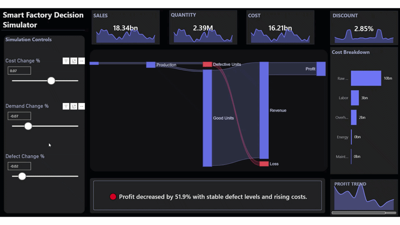
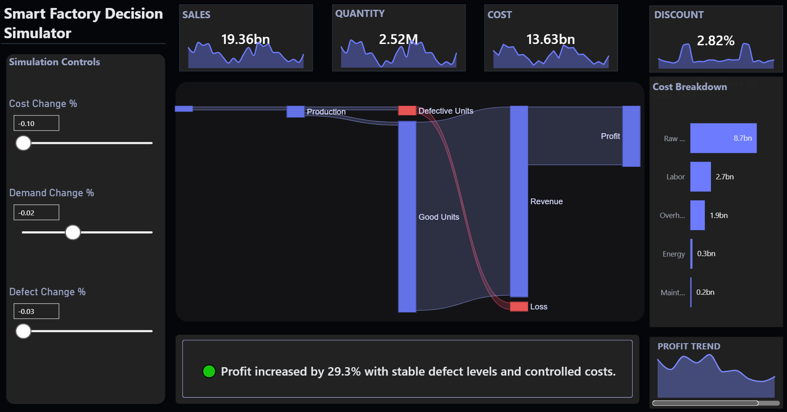
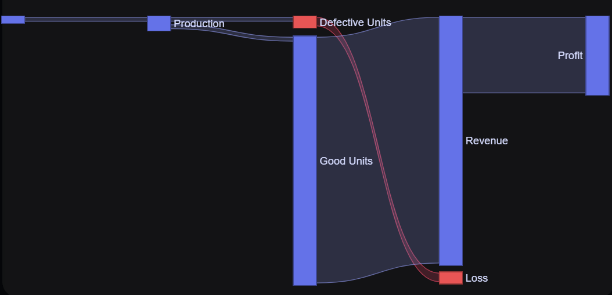
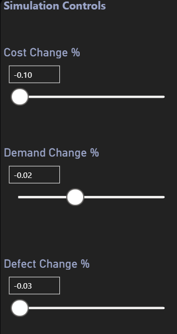

<h1 align="center">🏭 Smart Factory Decision Simulator</h1>

  <strong>Interactive Decision System built in Power BI</strong> 
  Simulate cost, demand, and defect impact on profitability in real time

  

---

## 🚀 Overview

The **Smart Factory Decision Simulator** is an advanced Power BI project that transforms a traditional dashboard into a **decision-making system**.

Instead of static reporting, this solution allows users to simulate real-world manufacturing scenarios by adjusting key operational drivers such as cost, demand, and defect rates — and instantly observe their impact on production, revenue, and profit.

---

## ⚡ Key Impact

- 📊 Real-time scenario simulation using parameter-driven DAX  
- 🔁 Dynamic KPI recalculation across all visuals  
- 🔗 Sankey-based production-to-profit flow visualization  
- 💡 Automated insight generation (business narrative)  
- 🎨 Custom-designed premium dark UI  

---

## 🎬 Demo

> Adjust sliders → Watch KPIs, flow, and insights update instantly  

This dashboard behaves like a **live decision engine**, not a static report.

---

## 🎯 Business Problem

Manufacturing teams often struggle to understand how operational changes impact profitability due to:

- Rising costs  
- Demand fluctuations  
- Quality issues (defects and losses)  

This project solves that by providing a **real-time simulation layer** that visually connects operational inputs to financial outcomes.

---

## ⚙️ Key Features

### 🎛️ Scenario Simulation Controls
- Cost Change %
- Demand Change %
- Defect Change %

---

### 📊 Dynamic KPI Cards
- Sales  
- Quantity  
- Cost  
- Defect Indicator  

---

### 🔁 Sankey Flow Visualization (Core Highlight)
Raw Material → Production → Good Units / Defective Units → Revenue / Loss → Profit  

---

### 📉 Cost Breakdown Panel
- Raw Material  
- Labor  
- Energy  
- Maintenance  
- Overhead  

---

### 📈 Profit Trend
- Scenario-based trend visualization  

---

### 💡 Insight Engine
Automatically generates business insights such as:

> *"Profit increased by 29.3% with stable defect levels and controlled costs."*

---

## 🧩 System Architecture
User Input (Sliders)
↓
What-if Parameters
↓
Adjusted DAX Measures
↓
KPI Cards | Sankey Flow | Cost Breakdown
↓
Insight Engine (Narrative Output)

---

## 🧠 Technical Implementation

### Data Model
- Fact Table: `fact_factory_daily`  
- Dimensions: `dim_date`, `dim_plant`, `dim_product`, `dim_scenario`  
- Helper Tables: `Cost Type`, `Sankey`  

---

### Key Measures
- Adjusted Revenue  
- Adjusted Units Sold  
- Adjusted Total Cost  
- Adjusted Defective Units  
- Adjusted Profit  
- Adjusted Defect Rate %  
- Flow Value  
- Adjusted Cost Value  
- Insight Text  

---

### Simulation Flow
1. User adjusts sliders  
2. Parameters trigger DAX recalculations  
3. KPIs update instantly  
4. Sankey reflects production changes  
5. Insight engine summarizes impact  

---

## 🖼️ Dashboard Preview

### Full Dashboard

### Sankey Simulation

### Controls & Insight Engine

---

## 🛠️ Tools & Technologies

- Power BI  
- DAX (Advanced)  
- What-if Parameters  
- Data Modeling (Star Schema)  
- Sankey Visual  
- UI/UX Design in Power BI  

---

## 💼 Skills Demonstrated

- Scenario-based analytics  
- Advanced DAX modeling  
- Interactive dashboard design  
- Data storytelling  
- Business problem solving  
- UI/UX thinking  

---

## ⭐ Why This Project Matters

Most dashboards show what happened.

👉 This project is different — it allows users to **simulate what will happen**.

It demonstrates:
- Decision-focused analytics  
- Scenario modeling  
- Business storytelling  
- Recruiter-ready project thinking  

---

## 📂 Repository Structure
smart-factory-decision-simulator/
│
├── data/
├── images/
├── pbix/
└── README.md

---

## 📌 Resume Highlight

- Built an interactive Power BI decision simulator using what-if parameters and advanced DAX  
- Modeled cost, demand, and defect scenarios to analyze profitability impact  
- Designed Sankey-based flow visualization for production-to-profit storytelling  

---

## 🔮 Future Enhancements

- Tooltip drill-down pages  
- Scenario bookmarking  
- Forecast-driven simulation  
- Multi-plant comparison  
- Executive summary export  

---

## 👤 Author

**Abhinay Badangi**  
Data Analyst | Power BI | SQL | Python  

🌐 Portfolio: https://abhinaybadangi.github.io/portfolio/

---

## 🚀 Final Thought

> This is not just a dashboard — it’s a **decision simulation system built in Power BI**.
